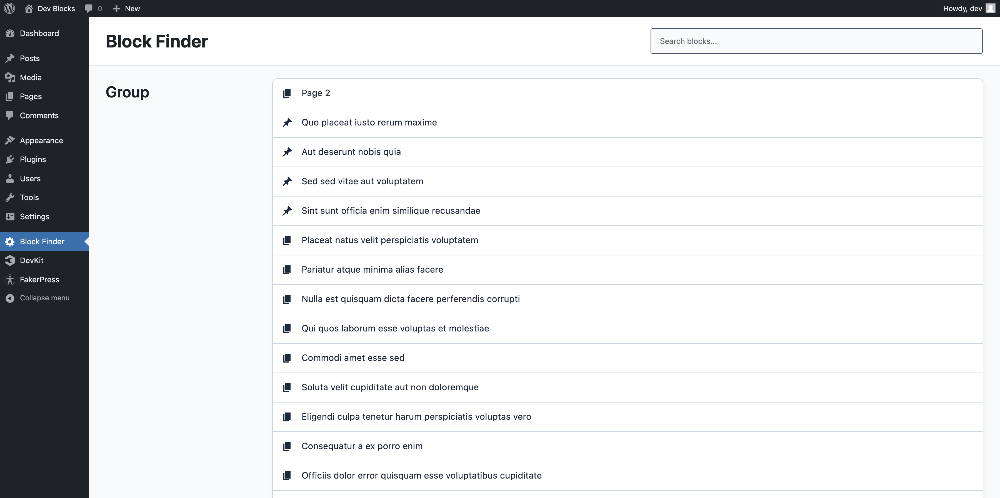
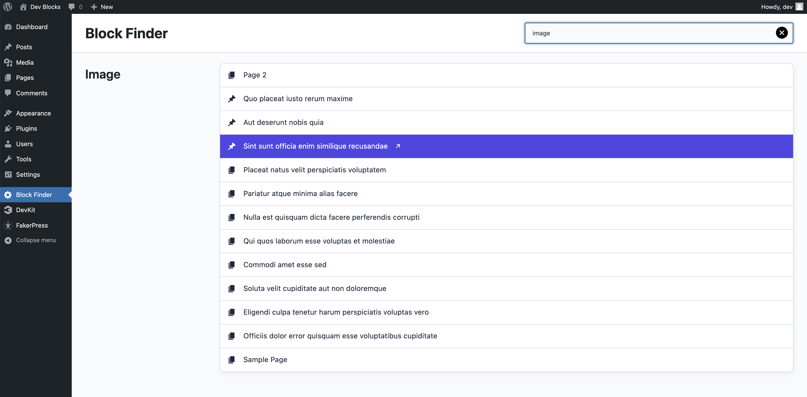
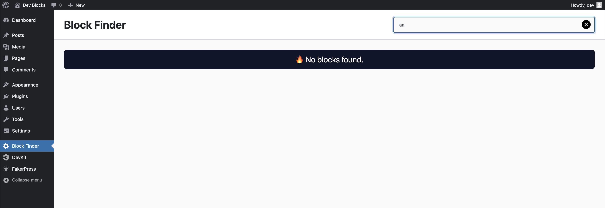

# Block Finder

Block Finder is a WordPress plugin that helps you discover and manage the usage of Gutenberg blocks across your WordPress site. It provides an intuitive interface in the WordPress admin area where you can search and filter blocks, view the posts and pages where each block is used, and manage your content more efficiently.

## Features

- **Search Blocks**: Quickly search for blocks by their title using an instant search feature.
- **View Block Usage**: See all the posts and pages where each block is used.
- **Filter Results**: Live filtering to show or hide block groups based on your search query.
- **Dashicons Support**: Displays WordPress dashicons next to the post/page links for easy identification of content types.
- **No Results Banner**: Displays a friendly message when no blocks match your search criteria.
- **Clear Search**: Easily clear the search input with a button or by pressing the Escape key.
- **Supports**: All post types, pages, templates and parts

## Installation

1. Download the [block-finder plugin files from the latest release](https://github.com/krstivoja/block-finder/releases/download/1.0.2/block-finder.zip) and upload them to your WordPress site's `wp-content/plugins/` directory.
2. Activate the plugin through the 'Plugins' menu in WordPress.

## Usage

1. Navigate to the **Block Finder** page in the WordPress admin menu.
2. Use the search bar to find blocks by their title.
3. View the list of posts and pages where each block is used.
4. Click on the post/page links to edit the content directly.

## Screenshots

1. **Main Interface**
   
   
2. **Search Feature**
   
   
3. **No Results Banner**
   

## Contributing

We welcome contributions to improve the Block Finder plugin! Here’s how you can help:

1. Fork the repository.
2. Create a new branch for your feature or bug fix.
3. Commit your changes and push the branch to your forked repository.
4. Open a pull request with a detailed description of your changes.

## License

This plugin is licensed under the GPL-2.0-or-later license. See the [LICENSE](LICENSE) file for more information.

## Credits

Block Finder is developed and maintained by [DPlugins](https://dplugins.com/).

